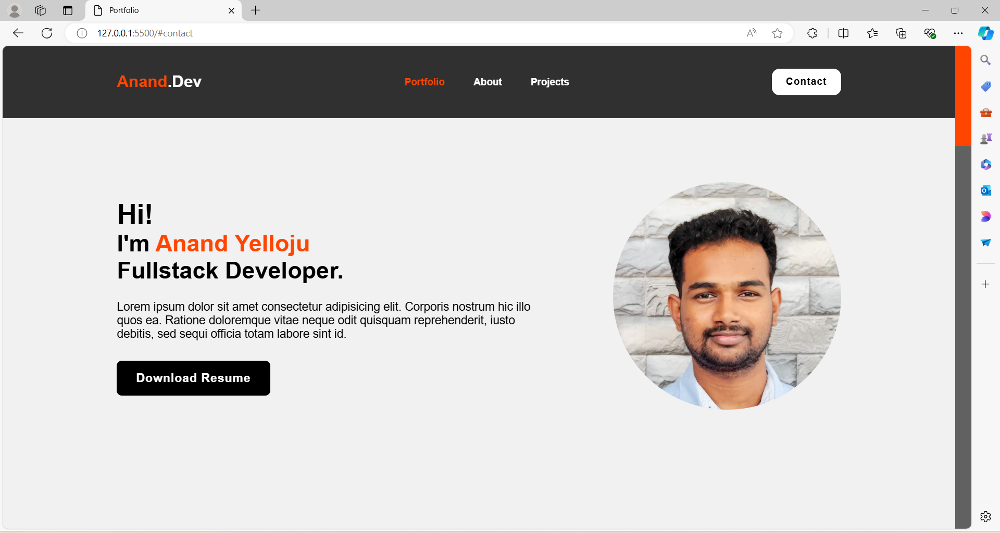
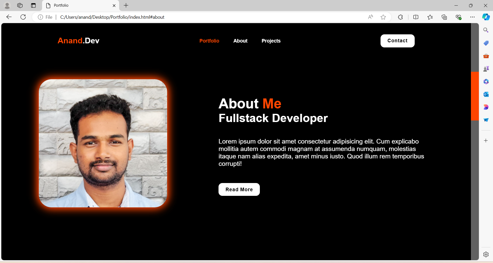
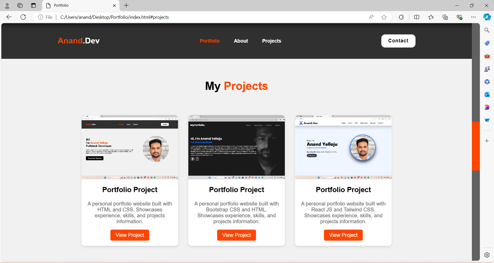
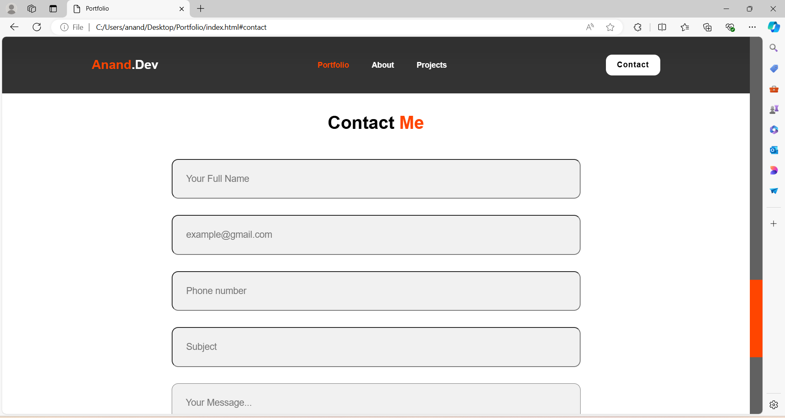
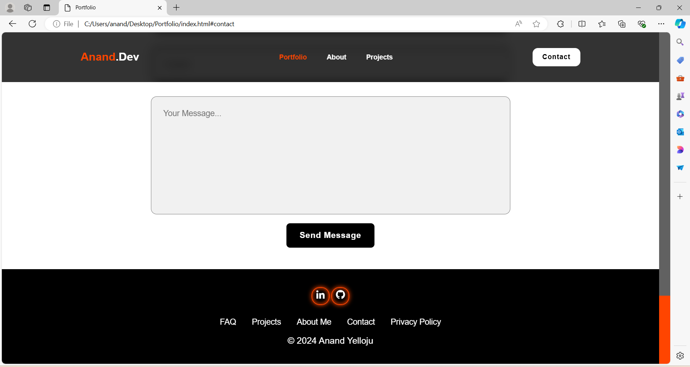
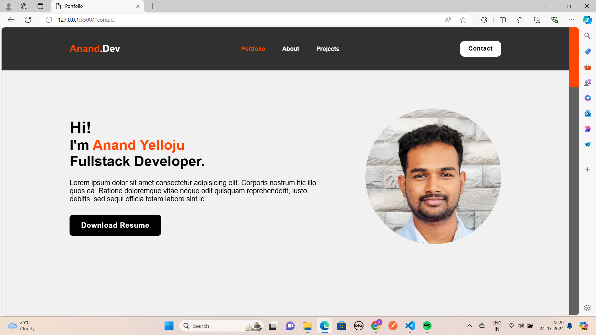

# Portfolio
A portfolio project developed during a [Udemy course](https://www.udemy.com/certificate/UC-3dacda21-b42e-4315-a6fa-e692ce948312/) instructed by Arunnachalam Shanmugaraajan, built using HTML and CSS.

## Table of Contents

- [Screenshots](#screenshots)
- [Installation](#installation)
- [Usage](#usage)
- [Features](#features)
- [Technologies Used](#technologies-used)
- [Contributing](#contributing)
- [Credits](#credits)
- [License](#license)

## Screenshots






<!--
## Installation

To set up this project locally, follow these steps:
1. Clone the repository:   
  ```
  git clone https://github.com/anandyelloju/portfolio-udemy-arunrs.git
  ```
2. Navigate to the project directory:
  ```
  cd portfolio-udemy-arunrs
  ```
3. Open the index.html file in your web browser to view the portfolio.

## Usage

After installation, you can view and edit the project directly in your web browser. The portfolio includes several sections:

- **Home:** Introduction.
- **About:** Summary of who you are, Education, and Overview of your technical skills.
- **Projects:** Showcase of your projects with descriptions and links.
- **Contact:** Form for visitors to get in touch with you.

**Example:** Adding a New Project\
To add a new project to the portfolio, update the index.html file as follows:

```
<div class="project-card">
  
  <div class="project-info">
    <h3>Portfolio Project</h3>
    <p>A personal portfolio website built with HTML and CSS. Showcases experience, skills, and projects information.</p>
    <a href="https://github.com/anandyelloju/portfolio-udemy-arunrs" target="_blank" class="project-link">View Project</a>
  </div>
</div>
```

## Features

- **Project Showcase:** Highlight your best projects with descriptions and links.

## Technologies Used

- **HTML:** Markup language for creating web pages.
- **CSS:** Stylesheet language for designing web pages.

[](https://skillicons.dev)

## Contributing

Contributions are always welcome! - If you have suggestions or improvements.

## Credits

- [Arunnachalam Shanmugaraajan](https://www.udemy.com/user/20cse099-arunnachalam-rs/): Instructor of the Udemy course

## License

This project is licensed under the [MIT License](https://choosealicense.com/licenses/mit/) - see the [LICENSE](https://github.com/anandyelloju/portfolio-udemy-arunrs/blob/main/LICENSE) file for details.
-->
